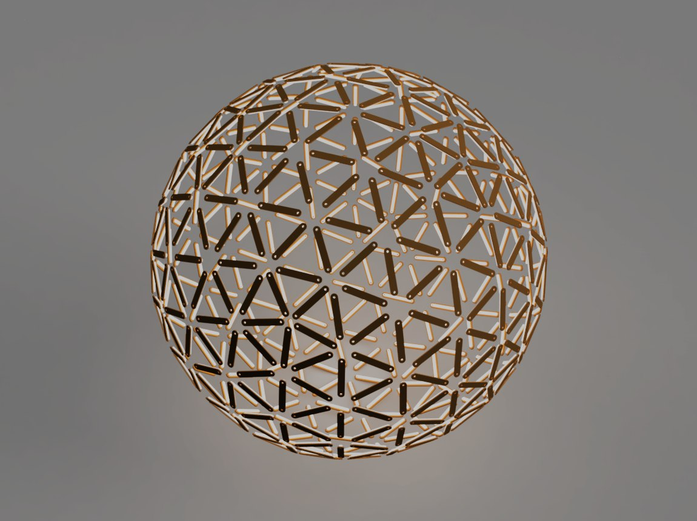

# Geodesic Sphere Builder

A browser-based generator for geodesic spheres — from geometry and part lists all the way to
DXF and STL files you can send to a laser cutter, CNC router or 3D printer.



You want to build a geodesic sphere but don't know where to start. This tool generates the
geometry for any frequency, sorts the parts into types, tells you how many of each you need,
and exports them as ready-to-cut files. The render above was produced from its DXF output.

No build step, no dependencies to install — open `index.html` and it runs.

## Quick start

```bash
git clone https://github.com/extosch/geodesic_sphere.git
cd geodesic_sphere
```

Open `index.html` in any modern browser. Three.js is loaded from a CDN, so you need to be
online the first time. A local web server (e.g. the VS Code Live Server extension) works too
and is the smoother option if you plan to edit the code.

## What you can set

| Parameter | Range | Notes |
|---|---|---|
| **Frequency (F)** | 1–10 | F=1 is the plain icosahedron. Geometry updates as you type |
| **Diameter (cm)** | 10–1000 | Physical size of the finished sphere |
| **Width (cm)** | 0.1–50 | Width of edge struts and connector arms |
| **Connector Offset (cm)** | 0–10 | How far the strut ends stop short of the vertex |
| **Strut Mode** | Classic / Uniform | Classic keeps the true edge lengths (several strut types). Uniform shortens every strut to the same length, so you only cut one type |

Width and Connector Offset **scale with 1/F automatically**. The input field always shows the
value for the current frequency; typing a new number adjusts the underlying base value, so the
proportion carries over when you change frequency.

## What you can see

Eight independent toggles, so you can isolate exactly the layer you are working on:

| Toggle | Shows |
|---|---|
| Show Faces | Solid gray sphere surface |
| Show Edges (Wireframe) | Edge grid, colour-coded by edge type |
| Show Edge Struts (Faces) | The flat capsule-shaped struts, coloured by type |
| Show Edge Struts (Wireframe) | Outlines of the same struts |
| Show Connectors (Wireframe) | Lines from each vertex to the strut ends |
| Show Connector Struts (Faces) | The flat star-shaped hub part at each vertex |
| Show Connector Struts (Wireframe) | Outlines of the hub parts |
| Show Center Test Strut | A single strut at the origin, for checking dimensions |

Plus auto-rotation. Drag with the left mouse button to rotate, right button to pan, wheel to zoom.

## What you get out

**Build instructions** are generated live: a table of edge lengths grouped by type (A, B, C…)
with the quantity needed for each, the number of 5-arm vs. 6-arm connectors, and the patch count.

**Exports:**

| Button | Output |
|---|---|
| Export All DXF | One DXF per part type — flat 2D outlines with holes, in mm, layered (OUTLINE / HOLES / LABELS) |
| Export STL (3D Mesh) | The whole assembled sphere as a single STL |
| Export STL (je Typ) | One STL per part type, containing every instance of that type positioned in 3D. The files together reassemble the complete sphere |

Exported filenames encode the parameters they were made with, e.g.
`Geo_F3_D100cm_W1.7cm_O2.3cm_A_Strut_x30.stl`, so you can tell prints apart later.

## Terminology

The code and the UI use these terms consistently:

| Term | Meaning |
|---|---|
| **Vertex** | A corner point of the sphere, lying on its surface |
| **Original Edge** | The full line between two vertices |
| **Shortened Edge** | Original edge minus the connector offset at both ends — this is where the strut sits |
| **Connector Edge** | The short piece from the vertex to the start of the shortened edge |
| **Edge Strut** | The flat capsule-shaped part on a shortened edge |
| **Connector** | The star-shaped hub part at a vertex, joining all struts that meet there |
| **Connector Arm** | One arm of that star, running along a connector edge |

## How it works

Start with a regular icosahedron: 12 vertices placed using the golden ratio, 20 equilateral
triangles. For frequency F, subdivide each triangle into F² smaller ones using barycentric
interpolation, then project every new point out onto the unit sphere. The projection is what
makes it a sphere rather than a faceted solid — and also why the edges end up in several
distinct length classes rather than all being equal.

| F | Vertices | Edges | Triangles |
|---|---|---|---|
| 1 | 12 | 30 | 20 |
| 2 | 42 | 120 | 80 |
| 3 | 92 | 270 | 180 |
| 4 | 162 | 480 | 320 |
| 5 | 252 | 750 | 500 |

Vertices follow `10F² + 2`, edges `30F²`, triangles `20F²`.

Struts and connectors are then laid out as **flat 2D parts** — that is the whole point, since
flat parts are what a laser cutter can produce. Each connector is built as one single star
part per vertex: a best-fit plane through the arm endpoints, the vertex projected onto it,
and a closed outline assembled from the arm boundary lines.

For the coordinate-system details, the connector outline construction and the scaling maths,
see [docs/technical-notes.md](docs/technical-notes.md).

## Project structure

```
index.html                        UI and layout
style.css                         Dark theme
js/main.js                        Global state, scaling functions
js/geodesic-sphere.js             GeodesicSphere class — subdivision, vertex/edge/face data
js/sphere-visualization.js        Sphere mesh, wireframe, build instructions
js/strut-visualization.js         Edge struts
js/connector-visualization.js     Connector wireframe and star parts
js/three-setup.js                 Three.js init, mouse controls, event wiring
js/dxf-export.js                  DXF output for laser/CNC
js/stl-export.js                  STL output (also carries OBJ/GLB exporters, not yet wired up)
docs/technical-notes.md           Algorithm and geometry details
docs/original-prompt.md           The prompt this project originally grew from
```

## Requirements

Any browser with WebGL: Chrome, Edge, Firefox, Safari, Opera. Built against Three.js r128.

## Credits

Built with Three.js and vanilla JavaScript — no framework, no build tooling.

This project was written with AI assistance from the start, and the *kind* of assistance
changed along the way — which turned out to matter more than the choice of model:

- **February 2026 onwards** — GitHub Copilot in VS Code, alongside Claude Sonnet 4.5 in a
  chat window. Autocomplete and copy-paste. Everything lived in a single `script.js`.
- **From March 2026** — Claude Code as a VS Code extension, latterly with Opus 5. Agentic
  rather than autocomplete: it reads the codebase, changes several files at once and runs
  the tooling itself. The split into `js/` modules, the connector geometry and the DXF and
  STL exporters came out of working that way.

The commit history still shows the seam. Single commits weeks apart at the beginning — then
five in one day on 23 March 2026, including the refactor from one file into six modules.

The prompt the whole thing originally grew from is kept in
[docs/original-prompt.md](docs/original-prompt.md).

## License

Free to use for educational and private purposes.
